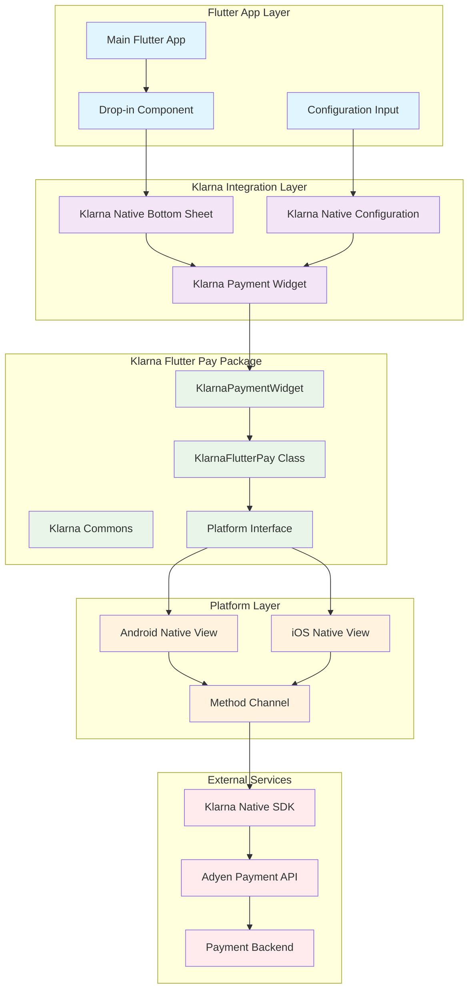
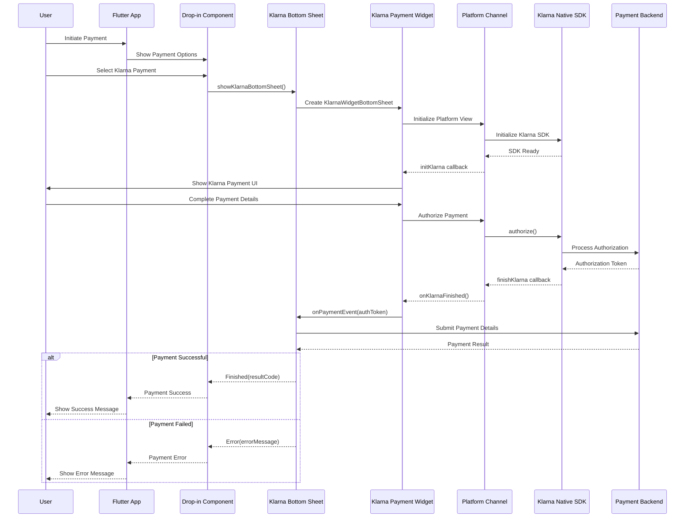
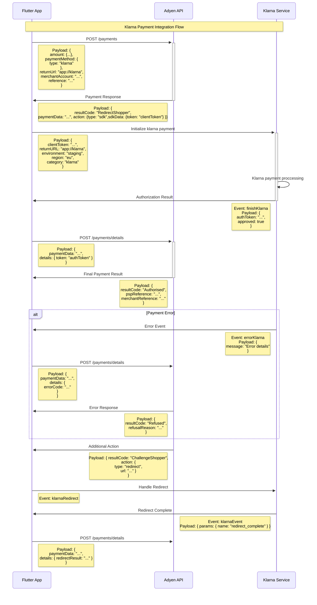

# Klarna Integration Architecture

## Overview
This diagram shows the complete Klarna payment integration flow within the Adyen In-Pay Flutter application.

## Architecture Diagram

## Payment Flow Sequence

## Klarna Integration Sequence Diagram

## Component Details

### Key Components

1. **KlarnaNativeConfiguration**
   - Stores client token, payment data, redirect URL
   - Configuration object for Klarna payments

2. **KlarnaWidgetBottomSheet**
   - Modal bottom sheet container
   - Handles payment events and callbacks
   - Manages navigation and result handling

3. **KlarnaPaymentWidget**
   - Core payment widget with platform views
   - Handles Android/iOS native implementations
   - Manages loading states and error handling

4. **Platform Integration**
   - Uses AndroidView/UiKitView for native rendering
   - Method channels for Flutter-Native communication
   - Supports both staging and production environments

### Payment States

- **Loading**: Initializing Klarna SDK
- **Ready**: Payment UI displayed to user
- **Processing**: Payment authorization in progress
- **Success**: Payment completed successfully
- **Error**: Payment failed or cancelled

### Environment Support

- **Staging**: Development and testing
- **Production**: Live payments
- **Regions**: EU and US support
